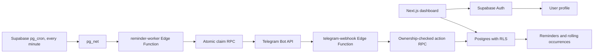
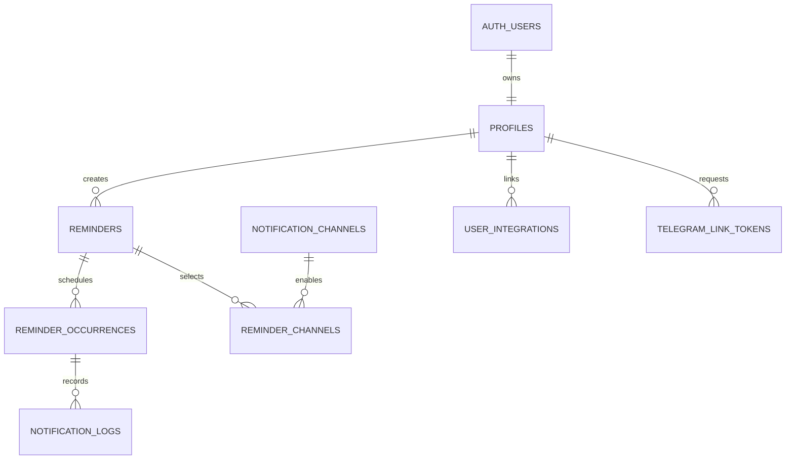

# Smart Reminder (PingMe)

Smart Reminder is a responsive personal reminder dashboard backed by Supabase Auth and PostgreSQL. Telegram delivery runs from Supabase Edge Functions and a single scheduled worker; no always-on server or local scheduler is required.

## Run locally

1. Install Node.js 22 or later.
2. Copy `.env.example` to `.env.local`, then set `NEXT_PUBLIC_SUPABASE_URL` and `NEXT_PUBLIC_SUPABASE_ANON_KEY` to the public project URL and publishable/anon key.
3. Run `npm install`, then `npm run dev` and open `http://localhost:3000`.

Without Supabase public settings, the dashboard runs in demo mode and stores demo reminders in this browser. Demo data is not sent to Supabase.

## Supabase setup

1. Install the Supabase CLI and link this directory to the intended project.
2. In Supabase Vault, create `smart_reminder_worker_url` and `smart_reminder_worker_secret`. The URL is `https://<project-ref>.supabase.co/functions/v1/reminder-worker`; the secret must exactly match the `WORKER_SECRET` function secret. Create these before the scheduler migration runs.
3. Apply the schema and scheduler with `supabase db push`. Migrations create tables, RLS, worker RPCs, required extensions, and exactly one cron job (`smart-reminder-worker`) running every minute.
   The Telegram wizard also requires migration `20261002000400_telegram_wizard_state.sql`; it is included in `supabase db push` and stores temporary conversation state.
4. Enable email/password authentication in Supabase Auth. New auth users receive a profile from the database trigger.
5. Deploy the Edge Functions:

   ```powershell
   supabase functions deploy reminder-worker --no-verify-jwt
   supabase functions deploy telegram-webhook --no-verify-jwt
   supabase functions deploy telegram-link-token
   ```

6. Set `TELEGRAM_BOT_TOKEN`, `TELEGRAM_BOT_USERNAME`, `WORKER_SECRET`, `TELEGRAM_WEBHOOK_SECRET`, and `TELEGRAM_ALLOWED_USER_IDS` as Supabase Function secrets. `TELEGRAM_ALLOWLIST_REQUIRED` defaults to `true`, so an empty allowlist rejects all Telegram users. Supabase provides its project URL and service-role key to Edge Functions. Never add service-role values to a `NEXT_PUBLIC_*` variable.
7. Configure Telegram's webhook URL as `https://<project-ref>.supabase.co/functions/v1/telegram-webhook` and use the exact `TELEGRAM_WEBHOOK_SECRET` value as Telegram's `secret_token`. Use a secret manager or protected operator session; do not put the bot token in source control or a shared shell history.
8. Deploy the Next.js frontend to Vercel or another Node-compatible host, set the two public Supabase environment variables there, and add the deployed URL to Supabase Auth redirect URLs.

The Telegram webhook supports `/start`, `/help`, `/reminder`, `/list`, `/today`, `/upcoming`, `/delete`, and `/cancel`. The interactive reminder wizard stores its short-lived conversation state in the `telegram_conversations` table created by migration `20261002000400_telegram_wizard_state.sql`. Apply all migrations with `supabase db push` before using `/reminder`. Telegram commands are handled by webhook; no always-on polling process is needed.

The worker claims bounded due rows with `FOR UPDATE SKIP LOCKED`, recovers stale claims after five minutes, caps attempts at five, and records provider attempts. Delivery is at-least-once with duplicate mitigation, not mathematically exactly-once.

## Architecture





PostgreSQL is the source of truth. Recurring reminders keep one rolling future occurrence; completion or skip creates the next one. All execution timestamps are `timestamptz`, while recurrence rules retain local wall-clock time and an IANA timezone.

## Features

- Email/password registration and sign-in through Supabase Auth.
- One-time, daily, multi-day weekly, and monthly reminders with optional end date, priority, category, and timezone.
- Weekly reminders include a one-tap weekdays preset for Monday through Friday.
- Overview, searchable/filterable reminder list, selectable calendar dates, occurrence history, and settings.
- Pause, resume, complete, delete, and snooze from the web app; Telegram callbacks also support skip and disable.
- Telegram linking via expiring one-time token; only a hash is stored and redemption is transactional.
- Telegram commands: `/start`, `/help`, `/reminder`, `/edit`, `/list`, `/today`, `/upcoming`, `/delete`, and `/cancel`. `/reminder` uses inline buttons for category, priority, repeat, and snooze choices.
- Local demo mode when public Supabase settings are absent.
- Reliability Center with worker health, stale-occurrence repair, and failed-delivery retry.
- Reminder JSON export/import, quick templates, bulk pause/resume/delete, and configurable cleanup retention.

## Install as a PWA

PWA installation requires an HTTPS deployment (or `localhost`). Deploy the app to Vercel or another HTTPS host, then:

- Android: open the deployed site in Chrome and choose **Install app** or **Add to Home screen**.
- iPhone/iPad: open the deployed site in Safari, tap **Share**, then **Add to Home Screen**.

The service worker caches the app shell and static icons for offline launch. Authentication, Supabase data, and Telegram actions still require a network connection.

## Data and security

Profiles, reminders, occurrences, notification channels, reminder channels, delivery logs, Telegram integrations, and link tokens are represented by migrations. RLS enforces user ownership. Clients cannot write occurrence state or notification logs directly; security-definer RPCs validate ownership and actions. Worker claims and Telegram updates use the service role only inside Edge Functions.

The worker emits structured events such as `worker_started`, `occurrence_claimed`, `notification_started`, `notification_sent`, and `notification_failed`. Logs include occurrence identifiers and provider outcomes, never configured credentials.

## Tests

- `npm run test:unit` checks daily/weekly/monthly recurrence, DST boundaries, and one-time schedules.
- `npm run test:db` runs the pgTAP schema/RLS/RPC smoke checks against the linked Supabase project.
- `npm run typecheck` and `npm run lint` validate the frontend.

Database tests currently check schema/security contracts; add isolated two-user RLS and concurrent-claim integration fixtures before production rollout.

## Troubleshooting

- `npm install` failures with `ENOTFOUND registry.npmjs.org` indicate DNS/network access to npm is unavailable; restore registry access, install dependencies, then run the checks above.
- A reminder remains pending until its Telegram account is linked, the global preference and per-reminder Telegram channel are enabled, and `smart_reminder_worker_url`/`smart_reminder_worker_secret` exist in Vault.
- Check Supabase Cron run history, Edge Function logs, and `notification_logs` for failed deliveries. Do not include secret values in support logs.
- Auth redirects must include the exact local or deployed callback URL in Supabase Auth settings.

## Roadmap

WhatsApp Business API, email delivery, natural-language scheduling, reminders templates, and aggregate statistics are not in this MVP. Do not use unofficial WhatsApp Web automation.

## Security notes

- `.env*` files are ignored by Git; only `.env.example` is allowed into the repository.
- Browser code reads only the Supabase URL and public anon/publishable key. RLS remains the ownership boundary.
- Keep the service-role key, Telegram bot token, webhook secret, and worker secret inside Supabase Function secrets/Vault only.
- The current local `.env` contains privileged Supabase credentials and was not ignored before this implementation. Keep it untracked and rotate the service-role/secret key and JWT signing secret in Supabase before using this project with real data.
- Configure Supabase Auth redirect URLs for local development and the deployed web origin.
