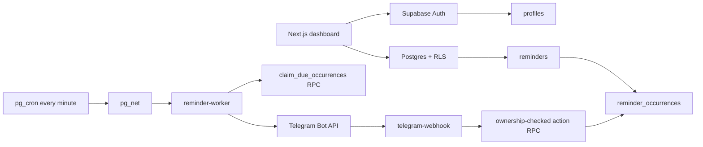

# Architecture

## System overview

PingMe uses PostgreSQL as the source of truth. The browser renders the dashboard and calls Supabase Auth, PostgREST, and ownership-checked RPCs. Telegram delivery is asynchronous: a cron job invokes the worker, the worker claims due occurrences, and the Telegram Bot API receives notifications.

## Authentication and authorization

1. Supabase Auth issues the browser session.
2. RLS policies scope dashboard reads and writes to `auth.uid()`.
3. Security-definer RPCs re-check ownership before changing occurrence state.
4. Edge Functions use the service role only on the server side.
5. Telegram access resolves a linked `user_integrations` record and applies the private allowlist.

## Database design

Core entities are `profiles`, `reminders`, `reminder_occurrences`, `notification_channels`, `reminder_channels`, `notification_logs`, `user_integrations`, `telegram_link_tokens`, and `telegram_conversations`. A recurring reminder keeps a rolling actionable occurrence while historical occurrences remain available for history and diagnostics.

## Time and recurrence

Execution timestamps use `timestamptz`. Recurrence rules preserve local wall-clock time and an IANA timezone. Date views filter occurrences in the reminder's timezone before selecting the relevant occurrence.

## Delivery lifecycle

The worker atomically claims bounded due rows with row locking, sends the provider request, records the attempt, and either completes the occurrence or records a retryable failure. Stale claims are repairable and attempts are bounded. Delivery is at-least-once with duplicate mitigation, not a mathematical exactly-once guarantee.

## Deployment architecture

- Vercel: Next.js frontend.
- Supabase: Auth, Postgres, RLS, Vault, pg_cron, pg_net, and Edge Functions.
- Telegram: external notification provider and webhook source.

Backend secrets must never be bundled into the browser application.
